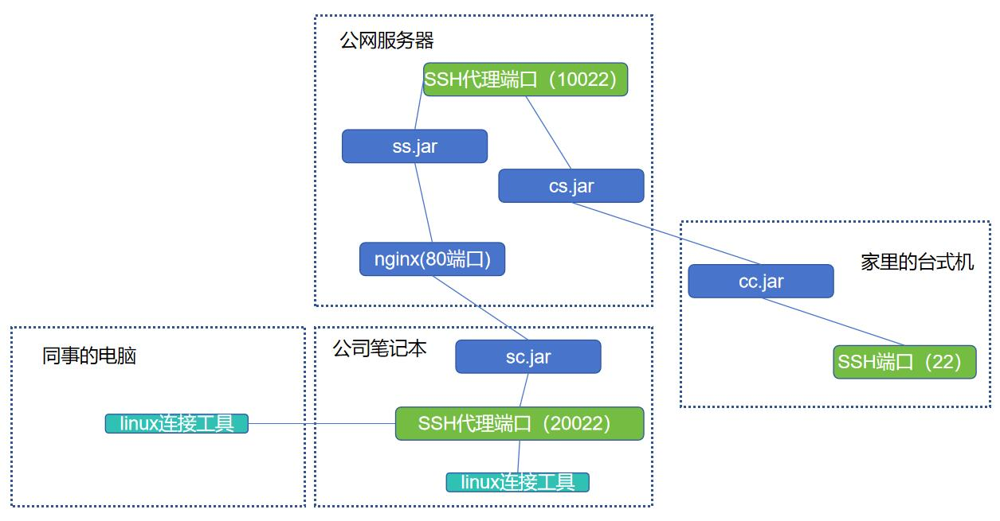

## 示例1 通过http端口，websocket反向代理访问内部服务器SSH端口

假设你有一个服务器集群，仅有一个nginx提供了80/443端口对外访问(111.222.33.44:80)，你想要访问集群中的应用服务器(192.168.0.2)的22端口，则可以按如下结构部署



1、在集群中任一服务器上新建一个hppt目录，并上传hppt.jar（也可用可执行文件 hppt.exe 或 hppt）、ss.yml、log4j2.xml文件到此目录下:

```
hppt
    - hppt.jar (or hppt.exe or hppt_linux_file)
    - ss.yml
    - log4j2.xml
```

并调整ss.yml的配置信息:

```yaml
type: websocket
#服务端口
port: 20871
# 允许的客户端账号和密码
clients:
  - user: user1
    password: 12345
  - user: user2
    password: 112233

```
（注1：作为快速演示，这里的type选择了最简单的post类型，此场景下最佳性能的协议为websocket，或是有独立端口的话可以配置hppt协议，ws、hppt版的说明奋力码字中。。）

（注2：实际应用中，为了确保安全，建议把clientId设置得更复杂一些）

执行如下命令运行服务端的hppt（3选1）

jar包运行
```shell
cd hppt
<jdk21_path>/bin/java -jar hppt.jar ss ss.yml
```

windows下可执行文件运行
```shell
cd hppt
chcp 65001
hppt.exe ss ss.yml
```

linux下可执行文件运行
```shell
cd hppt
./hppt ss ss.yml
#后台运行用命令  nohup ./hppt ss ss.yml >/dev/null &
```


在nginx上增加一段配置指向hppt

```
server {
    # 用https也ok的，对应修改nginx https配置即可
    listen       80;
    ...
    location /aaa/ {
        proxy_redirect off;
        proxy_pass http://192.168.0.1:20871/;
        proxy_http_version 1.1;
        proxy_set_header Upgrade $http_upgrade;
        proxy_set_header Connection "upgrade";
        proxy_set_header Host $http_host;
    }

    ...
```

随后，访问`http://111.222.33.44:80/aaa/` 能看到“not a WebSocket handshake request”字样即证明服务端部署成功。

2、自己笔记本上，新建一个hppt目录，拷贝hppt.jar (or hppt.exe or hppt_linux_file)、sc.yml、log4j2.xml文件到此目录下:

```
hppt
    - hppt.jar
    - sc.yml
    - log4j2.xml
```

并调整sc.yml的配置信息:

```yaml
# 和服务端的type保持一致
type: websocket
# 客户端用户名，每个sc进程用一个，不要重复
clientUser: user1
# 客户端密码
clientPassword: 12345


websocket:
  #服务端http地址，可以填nginx转发过的地址
  serverUrl: "ws://111.222.33.44:80/aaa"
  # 服务端http地址，不用nginx的话直接配原始的服务端端口
  #serverUrl: "ws://111.222.33.44:20871"
forwards:
  # 把192.168.0.2的22端口代理到本机的10022端口
  - localPort: 10022
    remoteHost: "192.168.0.2"
    remotePort: 22
    # 同理也可以代理数据库等任意TCP端口，只要服务端的hppt所在服务器能访问到的端口都行
  - localPort: 10023
    remoteHost: "192.168.0.3"
    remotePort: 3306


```

执行如下命令启动客户端的hppt（3选1）

jar包运行
```shell
cd hppt
<jdk21_path>/bin/java -jar hppt.jar sc sc.yml
```

windows下可执行文件运行
```shell
cd hppt
chcp 65001
hppt.exe sc sc.yml
```

linux下可执行文件运行
```shell
cd hppt
./hppt sc sc.yml
#后台运行用命令  nohup ./hppt ss ss.yml >/dev/null &
```

随后，你就可以在公司用linux连接工具访问localhost的10022端口，来登录应用服务器了
