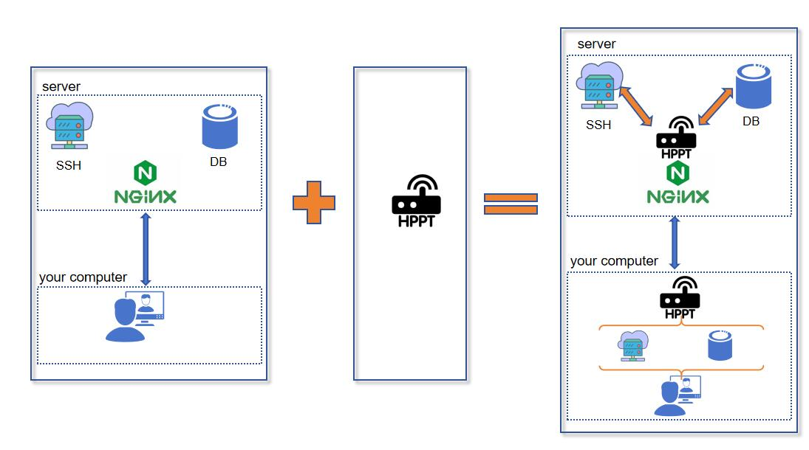
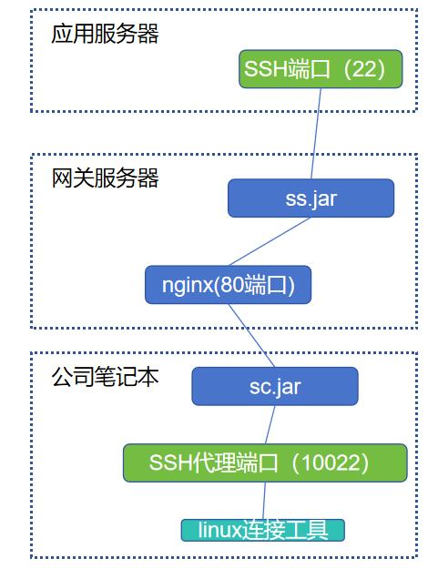
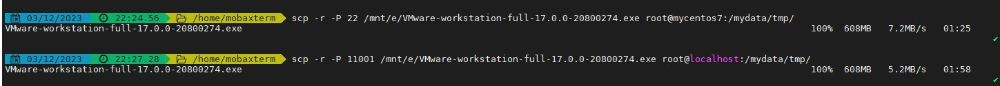

hppt，一款基于纯HTTP协议的内网穿透、反向代理工具

# 快速开始

本项目需要jdk21启动，请先前往[jdk官网](https://jdk.java.net/21/)
下载对应你操作系统版本的jdk，然后在[releases](https://github.com/codingmiao/hppt/releases)
页面下载最新版本编译好的hppt.zip，或自行下载源码编译

## 示例一 内网穿透，通过公网转发，访问无公网IP的服务器

假设你家里有一台台式机(ssh端口为22)，并且有一台公网VPS服务器(ip 112.242.68.66)，你想在公司用笔记本登录家里的台式机，可按如下结构部署：



1、拷贝cs文件夹到公网服务器上:

```
cs
    - cs.jar
    - cs.yml
    - log4j2.xml
```

并调整cs.yml的配置信息:

```yaml
# http服务端口
port: 30871
# 是否启用压缩，默认启用 需和服务端保持一致
enableCompress: true
# 是否启用内容加密，默认启用 需和服务端保持一致
enableEncrypt: true
# 客户端配置列表
clients:
  - # 客户端ID
    clientId: home
    # 客户端转发配置列表
    forwards:
      - localPort: 10022
        remoteHost: "localhost"
        remotePort: 22
```

执行如下命令启动cs.jar

```shell
<jdk21_path>/bin/java -jar cs.jar
```

2、拷贝cc文件夹到在家里的台式机上：

```
cc
    - cc.jar
    - cc.yml
    - log4j2.xml
```

修改cc.yml

```yaml
# 客户端id，每个cc.jar用一个，不要重复
clientId: home
# 服务端http地址，可以填nginx转发过的地址
serverUrl: "http://112.242.68.66:30871"
# 开始时闲置几毫秒发一次http请求，越短延迟越低但越耗性能
initSleepTime: 10
# 当收到空消息时，闲置毫秒数增加多少毫秒
addSleepTime: 100
# 闲置毫秒数最大到多少毫秒
maxSleepTime: 10000
# 当用户端输入字节时，唤醒发送线程，此后多少毫秒不睡眠
awakenTime: 15000
# 向服务端发数据请求体的字节数最大值 有时会出现413 Request Entity Too Large问题，没办法改nginx的话就用这个值限制
maxSendBodySize: 2147483647
# 是否启用压缩，默认启用 需和服务端保持一致
enableCompress: true
# 是否启用内容加密，默认启用 需和服务端保持一致
enableEncrypt: true

```

其中`http://112.242.68.66:30871`即第一步在公网服务器上部署的cs.jar的访问地址，如果不希望直接暴露30871端口，也可以通过nginx转一下：

```
server {
    listen       80;
    ...
    location /xxx/ {
        proxy_pass http://localhost:30871/;
    }
    ...
```

这样配nginx然后修改serverUrl配置为 `serverUrl: "http://112.242.68.66:80/xxx"` 即可

执行如下命令启动cs.jar

```shell
<jdk21_path>/bin/java -jar cc.jar
```

随后，你就可以在公司用linux连接工具访问112.242.68.66的10022端口，来登录家里的台式机了

## 示例二 通过http端口，反向代理访问内部服务器

假设你有一个服务器集群，仅有一个nginx提供了80端口对外访问(112.242.68.66:80)，你想要访问集群中的应用服务器(192.168.0.2)
的22端口，则可以按如下结构部署



1、拷贝ss文件夹到网关服务器上:

```
ss
    - ss.jar
    - ss.yml
    - log4j2.xml
```

并调整ss.yml的配置信息:

```yaml
#服务http端口
port: 20871
#超过sessionTimeout，给客户端发送存活确认命令，若下一个sessionTimeout内未收到确认，则强制关闭服务
sessionTimeout: 60000
#接收到客户端/真实端口的数据时，数据被暂存在一个队列里，队列满后强制关闭会话
messageQueueSize: 20480
#上传/下载文件用的目录
fileDir: /data/ss/dt
#是否启用压缩，默认启用 需和客户端保持一致
enableCompress: true
#是否启用内容加密，默认启用 需和客户端保持一致
enableEncrypt: true
# 允许的客户端id
clientIds:
  - book

```

执行如下命令启动ss.jar

```shell
<jdk21_path>/bin/java -jar ss.jar
```

在nginx上配置一个代理指向ss.jar

```
server {
    listen       80;
    ...
    location /xxx/ {
        proxy_pass http://localhost:20871/;
    }
    ...
```

2、拷贝sc文件夹到自己笔记本上:

```
sc
    - sc.jar
    - sc.yml
    - log4j2.xml
```

并调整sc.yml的配置信息:

```yaml
#客户端id，每个sc.jar用一个，不要重复
clientId: book
#服务端http地址，可以填nginx转发过的地址
serverUrl: "http://112.242.68.66:80/xxx"
#开始时闲置几毫秒发一次http请求，越短延迟越低但越耗性能
initSleepTime: 10
#当收到空消息时，闲置毫秒数增加多少毫秒
addSleepTime: 1000
#闲置毫秒数最大到多少毫秒
maxSleepTime: 60000
#向服务端发数据请求体的字节数最大值 nginx代理的话，如果没办法修改配置，会出现413 Request Entity Too Large问题，没办法改nginx的话就用这个值限制
maxSendBodySize: 1024000
#是否启用压缩，默认启用 需和服务端保持一致
enableCompress: true
#是否启用内容加密，默认启用 需和服务端保持一致
enableEncrypt: true
forwards:
  - localPort: 10022
    remoteHost: "192.168.0.2"
    remotePort: 22

```

执行如下命令启动sc.jar

```shell
<jdk21_path>/bin/java -jar sc.jar
```

随后，你就可以在公司用linux连接工具访问localhost的10022端口，来登录应用服务器了

## 示例三 组合玩法

组合示例一、二，实现更多有趣的玩法，比如把家里的端口代理到自己笔记本上，给其它同事的电脑访问：


# Q&A

## 性能如何？

由于http本身短连接、带了很多请求头等无用信息之类的原因，比直连损耗30%以上的效率。

以下是scp命令拷贝一份文件，直连和使用hppt反代的耗时对比：



## 为什么用http post，不用websocket或sse之类的长连接技术？

条件不允许^_^，笔者写这个工具，就是因为使用环境里需要通过nginx转发，而nginx不允许配ws、sse相关的参数。

所以，用http post就是为了最大的适配能力，这个项目就是：要通用性有通用性、要性能有通用性^_^。

## 安全性如何？

必须使用指定的clientId才能连接，数据传输过程中对字节进行了加密，如果你还需要更多的个性化验证，比如用户登录，可以发邮件到[liuyu@wowtools.org](liuyu@wowtools.org)
进行定制化开发。

# 后续计划

输入字节审计

自定义字节修改功能
