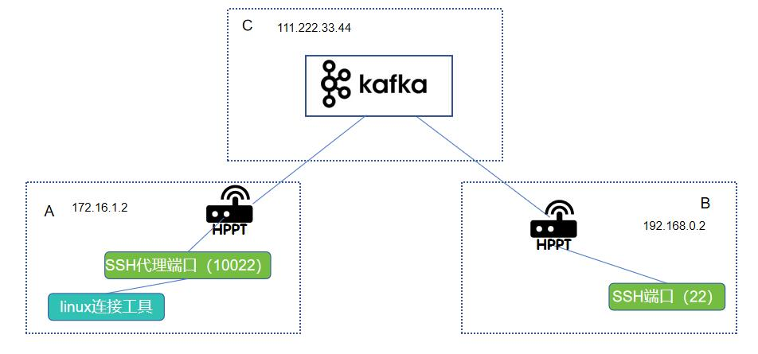

hppt, a tool that can forward TCP ports over any protocol.

[中文](./readme.md)&nbsp;&nbsp;&nbsp;&nbsp;[English](./readme_en.md)

[github](https://github.com/codingmiao/hppt)&nbsp;&nbsp;&nbsp;&nbsp;[gitee](https://gitee.com/wowtools/hppt)

# Introduction
In daily work, we often encounter many inconveniences due to the inability to access certain remote ports. For example, in scenarios where a server's firewall only leaves ports 80/443 open for web access, if you wish to access services like databases or SSH on the server, you can use this tool to map the required ports:


# Quick Start
Download the latest pre-compiled version of hppt from the [releases](https://github.com/codingmiao/hppt/releases) page.

Or compile the source code yourself:
```shell
#jar
mvn clean package -DskipTests

#Optional: Build native package
su graalvm
cd run
mvn org.graalvm.buildtools:native-maven-plugin:build
```

This project is compiled into executable files and jar packages.

The executable files have no environmental dependencies and use less memory, but due to the lack of JIT support, their performance is slightly inferior to running the jar package.

The jar package performs better but consumes more memory. To run the jar package, please download the corresponding JDK21 for your operating system from the [JDK official website](https://jdk.java.net/archive/).

## Example 1: Accessing an Internal Server's SSH Port via HTTP Port Reverse Proxy

Assume you have a server cluster where only an nginx provides ports 80/443 for external access (111.222.33.44:80), and you want to access port 22 of an application server (192.168.0.2) in the cluster. You can deploy it as follows:


1. Create a new hppt directory on any server in the cluster, and upload hppt.jar (or the executable file hppt.exe or hppt), ss.yml, and logback.xml to this directory:

```
hppt
    - hppt.jar (or hppt.exe or hppt_linux_file)
    - ss.yml
    - logback.xml
```

Adjust the configuration information in ss.yml:

```yaml
# Use HTTP POST protocol to transmit data. This protocol is the simplest but has slightly lower performance. If needed, refer to the WebSocket protocol, hppt protocol, or custom protocol.
type: post
# Service HTTP port
port: 20871
# Allowed client accounts and passwords
clients:
  - user: user1
    password: 12345
  - user: user2
    password: 112233
```
(Note 1: For a quick demo, the simplest POST type is chosen here. In this scenario, you can configure WebSocket as per [this document](_doc/demo/websocket.md) for better performance, or if you have an independent port, you can configure the hppt protocol as per [this document](_doc/demo/hppt.md).)

(Note 2: In practical applications, for security reasons, it is recommended to set more complex passwords.)

Run the following command to start the server-side hppt (choose one of three):

Run with jar package
```shell
cd hppt
<jdk21_path>/bin/java -jar hppt.jar ss ss.yml
```

Run with executable file on Windows
```shell
cd hppt
chcp 65001
hppt.exe ss ss.yml
```

Run with executable file on Linux
```shell
cd hppt
./hppt ss ss.yml
# For background running, use the command: nohup ./hppt ss ss.yml >/dev/null &
```

Add a configuration section on nginx to point to hppt:

```
server {
    # Using HTTPS is also okay; just modify the nginx HTTPS configuration accordingly.
    listen       80;
    ...
    location /xxx/ {
        proxy_pass http://localhost:20871/;
    }
    ...
```

Then, accessing `http://111.222.33.44:80/xxx/` and seeing "error 404" indicates that the server-side deployment was successful.

2. On your laptop, create a new hppt directory, copy hppt.jar (or hppt.exe or hppt_linux_file), sc.yml, and logback.xml to this directory:

```
hppt
    - hppt.jar (or hppt.exe or hppt_linux_file)
    - sc.yml
    - logback.xml
```

Adjust the configuration information in sc.yml:

```yaml
# Keep consistent with the server's type
type: post
# Client username; use one per sc process and avoid duplication.
clientUser: user1
# Client password
clientPassword: 12345

post:
  # Server HTTP address. If direct connection is not possible, using nginx proxy and filling in nginx's address is also okay.
  serverUrl: "http://111.222.33.44:80/xxx"
  # In this example, without nginx, directly configure the original server port.
  #serverUrl: "http://111.222.33.44:20871"
  # Artificially set delay (milliseconds). Generally, set to 0. For scenarios with large data transfers like file transfers and low latency requirements, set a delay of a few hundred milliseconds to reduce the frequency of POST requests.
  sendSleepTime: 0
forwards:
    # Proxy port 22 of 192.168.0.2 to port 10022 on the local machine.
  - localPort: 10022
    remoteHost: "192.168.0.2"
    remotePort: 22
    # Similarly, any TCP port like databases can be proxied, as long as the server-side hppt can access the port.
  - localPort: 10023
    remoteHost: "192.168.0.3"
    remotePort: 3306
```

Run the following command to start the client-side hppt (choose one of three):

Run with jar package
```shell
cd hppt
<jdk21_path>/bin/java -jar hppt.jar sc sc.yml
```

Run with executable file on Windows
```shell
cd hppt
chcp 65001
hppt.exe sc sc.yml
```

Run with executable file on Linux
```shell
cd hppt
./hppt sc sc.yml
# For background running, use the command: nohup ./hppt ss ss.yml >/dev/null &
```

Then, you can use a Linux connection tool at the company to access port 10022 on localhost to log in to the application server.

## Example 2: Intranet Penetration, Accessing a Server Without a Public IP via Public Network Forwarding

Assume you have a desktop at home (SSH port 22) and a public VPS server (IP 111.222.33.44). You want to log in to your home desktop from your company laptop. You can deploy it as follows:


1. On the public server, create a new hppt directory, copy hppt.jar (or the executable file hppt.exe or hppt), sc.yml, and logback.xml to this directory:

```
hppt
    - hppt.jar (or hppt.exe or hppt_linux_file)
    - sc.yml
    - logback.xml
```

Adjust the configuration information in sc.yml:

```yaml
# Communication protocol. This example uses the highest-performance hppt protocol. The 'r' prefix indicates the client and server roles are swapped. HTTP POST or WebSocket can also be configured here.
type: rhppt
# Client username; use one per sc process and avoid duplication.
clientUser: user1
# Client password
clientPassword: 12345

# Service port
rhppt:
  port: 20871

# Heartbeat packet sending interval
heartbeatPeriod: 30000

forwards:
    # Proxy port 22 of 192.168.0.2 to port 10022 on the local machine.
  - localPort: 10022
    remoteHost: "192.168.0.2"
    remotePort: 22
    # Similarly, any TCP port like databases can be proxied, as long as the server-side hppt can access the port.
  - localPort: 10023
    remoteHost: "192.168.0.3"
    remotePort: 3306
```

Run the following command to start hppt on the public server (choose one of three):

Run with jar package
```shell
cd hppt
<jdk21_path>/bin/java -jar hppt.jar sc sc.yml
```

Run with executable file on Windows
```shell
cd hppt
chcp 65001
title "hppt"
hppt.exe sc sc.yml
pause
```

Run with executable file on Linux
```shell
cd hppt
./hppt sc sc.yml
# For background running, use the command: nohup ./hppt ss ss.yml >/dev/null &
```

2. On the home desktop, create a new hppt directory, copy hppt.jar (or the executable file hppt.exe or hppt), ss.yml, and logback.xml to this directory:

```
hppt
    - hppt.jar (or hppt.exe or hppt_linux_file)
    - ss.yml
    - logback.xml
```

Modify ss.yml:

```yaml
# Communication protocol; keep consistent with the client and server.
type: rhppt
# Service HTTP port
port: 20871

# Point to the IP and port of the service started in the previous step.
rhppt:
  host: "111.222.33.44"
  port: 20871

# Heartbeat packet check interval; restart the service if no heartbeat packet is received from the client within this time (milliseconds).
heartbeatTimeout: 3600000

# Allowed client accounts and passwords
clients:
  - user: user1
    password: 12345
  - user: user2
    password: 112233
```

Run the following command to start hppt on the home desktop (choose one of three):

Run with jar package
```shell
cd hppt
<jdk21_path>/bin/java -jar hppt.jar ss ss.yml
```

Run with executable file on Windows
```shell
cd hppt
chcp 65001
title "hppt"
hppt.exe ss ss.yml
pause
```

Run with executable file on Linux
```shell
cd hppt
./hppt ss ss.yml
# For background running, use the command: nohup ./hppt ss ss.yml >/dev/null &
```

Then, you can use a Linux connection tool at the company to access port 10022 on 111.222.33.44 to log in to your home desktop.

## Example 3: Writing a Custom Protocol
As shown in the figure below, machines A and B cannot communicate directly, but they can both access Kafka on machine C. This example demonstrates how to write a custom protocol to allow A to access B's SSH port using Kafka on C as a bridge:



First, clone this project locally, then run `mvn clean install` to install it into Maven.

Then create a new Java project, add hppt-run and Kafka Maven dependencies:
```xml
        <dependency>
            <groupId>org.wowtools.hppt</groupId>
            <artifactId>run</artifactId>
            <version>1.0-SNAPSHOT</version>
        </dependency>
        <!--Continue adding other dependencies-->
```
Then you can write the code:

Write a server-side implementation and run it on machine B. You need to implement the following methods:
```java
public class ServerDemo extends ServerSessionService<T> {

    public ServerDemo(SsConfig ssConfig) {
        super(ssConfig);
    }

    //What to do during initialization
    public void init(SsConfig ssConfig) throws Exception {
    }

    //How to send bytes to the client
    protected void sendBytesToClient(T ctx, byte[] bytes) {
    }

    //When receiving bytes from the client, actively call receiveClientBytes(CTX ctx, byte[] bytes)

    //What to do when the client disconnects
    protected void closeCtx(T ctx) throws Exception {
    }

    //After the server is closed, release resources like connection pools here
    protected void doClose() throws Exception {
    }
}
```
For a complete example implementation, refer to [here](kafkademo/src/main/java/org/wowtools/hppt/kafkademo/ServerDemo.java).

Write a client-side implementation and run it on machine B. You need to implement the following methods:
```java
public class ClientDemo extends ClientSessionService {
    public ClientDemo(ScConfig config) throws Exception {
        super(config);
    }

    //How to connect to the server
    protected void connectToServer(ScConfig config, Cb cb) throws Exception {
    }

    //How to send bytes to the server
    protected void sendBytesToServer(byte[] bytes) {
    }

    //When receiving bytes from the server, actively call receiveServerBytes(byte[] bytes)
}
```
For a complete example implementation, refer to [here](kafkademo/src/main/java/org/wowtools/hppt/kafkademo/ClientDemo.java).

Then, you can access port 10022 on A to connect to port 22 (SSH) on B.

# Q&A

## How is the performance?

When using long-connection protocols like hppt or WebSocket, this project only performs forwarding, encryption, and decryption operations, with performance loss within 5%. Below is a comparison of the time taken to copy a 186MB file using the scp command in Example 2, connecting to the original port and the proxy port:

```shell
# Direct connection
scp -P 22 jdk-21_linux-aarch64_bin.tar.gz   root@xxx:/xxx                                                                                                                          
100%  186MB   7.5MB/s   00:25
# Proxy
scp -P 10022 jdk-21_linux-aarch64_bin.tar.gz   root@xxx:/xxx                                                                                                                          
100%  186MB   7.2MB/s   00:26
```

However, if HTTP POST is used as the transport protocol, the loss is more significant due to HTTP's short connections and redundant request headers. In test environments, the loss can even reach around 30%. Therefore, in performance-sensitive scenarios, it is recommended to use long-connection protocols. Short-connection protocols should only be used when performance is not a concern or when the environment does not permit long connections.

## How secure is it?

Only specified users can connect, and data transmission is encrypted to prevent eavesdropping. If you need additional personalized verification, such as user login, you can email [liuyu@wowtools.org](liuyu@wowtools.org) for customized development.

# Future Plans

Complete the rwebsocket protocol and optimize the performance overhead of the rpost protocol.

Develop relay mode.

Improve documentation and demos.

...(Feel free to suggest more ideas via issues or email.)
